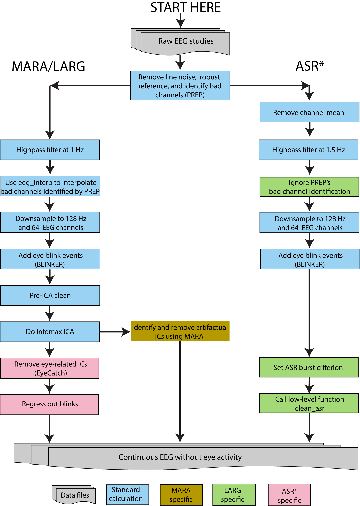

# EEG-Pipelines
*Various automated MATLAB pipelines for preprocessing EEG*

This repository holds several pipelines which were used to benchmark how
much differences in EEG preprocessing affect downstream results as reported
in the following paper: 

> How sensitive are EEG results to preprocessing methods: A Benchmarking study  
> Kay A. Robbins, Jonathan Touryan, Tim Mullen, Christian Kothe, Nima Bigdely-Shamlo  
> bioRxiv 2020.01.20.913327; doi: https://doi.org/10.1101/2020.01.20.913327 

## Software requirements and setup
The pipelines use MATLAB and [EEGLAB](https://sccn.ucsd.edu/eeglab/index.php "EEGLAB homepage"). The code was tested using MATLAB 2019a and EEGLAB v2019.1. The pipelines assume the MATLAB statistics toolbox. Computation of the spectral
fingerprints and spectral samples assumes the MATLAB wavelet toolbox.

### Setup of EEGLAB
The instructions are based on EEGLAB v2019.1 or later. The following
EEGLAB plugins were installed in the default configuration:
 1. clean_rawdata2.1
 2. dipfit
 3. firfilt2.3
 4. ICLabel1.1  

We also installed the following EEGLAB plugins:
 1. blinker1.1.2
 2. MARA1.2
 3. PrepPipeline0.55.3

By installation, we mean that these plugins are unzipped into the EEGLAB/plugin directory.
You should add them to your MATLAB path by running eeglab, not by trying to 
add individual directories to your path.

### Additional setup
You will also need go download eye-catch from https://github.com/bigdelys/eye-catch.
Add this directory to your path as well.

### Add the pipelines to your path by executing:
    runEEGPipelineProjectPaths

## Data requirements and preparation

**EEG:** The EEG recording should be in `EEG.set` file format. The recording should be at least 15 minutes in length in order for the pipelines to work effectively, as several of the components (such as PREP and Blinker) use signal statistics to set thresholds. ASR needs data to calibrate. 

**Channel locations:** The input `EEG.set` file MUST have channel locations included. Furthermore, the 
`EEG.chanlocs.type` fields must be set so that the EEG channels have the
type 'EEG'. PREP, Blinker, MARA and other tools
rely on being able to reliably distinguish the EEG channels from auxilliary
channels in order to set their defaults. In our implementation, we remove 
the non-EEG channels in the first step.  If you do not wish to do this, you 
must give channels to be excluded in several steps. To simplify the 
implementation, this code removes non-EEG channels as the first step in the 
pipeline. 

**Reduction of number of channels:** The pipeline implementation reported
in our publication reduces the number of channels to 64 prior to performing
most of the pipeline. To do this, you must provide a channel mapping. We have
provided one channel mapping (for Biosemi 256-channel headsets into closest
channels in Biosemi 64-channel headsets using standard caps). The pipelines
can be run with more than 64 channels, but we have not evaluated the results
for more channels.

## Pipeline details

The original pipelines were implemented using a code infrastructure
that supports large-scale processing. The codes in this repository were 
stripped out of that infrastructure and redesigned to run on a single EEG
recording file in .set file format.  The code was tested on MATLAB
2019a and EEGLAB version eeglab2019_1. 

The pipelines are fully automated, once the parameters at the top of 
each script are set. The supported pipelines are:
  * LARG uses ICA, Blinker, and eye-catch to identify and remove eye artifacts. (Note: this implementation allows subtraction of a residual blink signal, but does not currently implement regression out of blinks during preprocessing.)
  * MARA uses ICA and MARA to identify and remove eye artifacts.
  * ASR uses standard application of ASR from raw data (`clean_artifacts`).
  * ASRalt uses PREP for line noise, robust referencing, 
    and bad channel identification and Hamming windows for filtering (as the
    LARG and MARA pipelines do). It then uses only the artifact subspace 
    removal portion of ASR (`clean_asr`) to remove artifacts.
    (This alternative is not necessarily recommended, but was developed to
     make a closer comparison with LARG and MARA.)

The paper used cudaica for some of the computations of ICA. This requires special hardware and setup. That version of the code has not been included in the repository. We assume runica from EEGLAB for the ICA decomposition.

